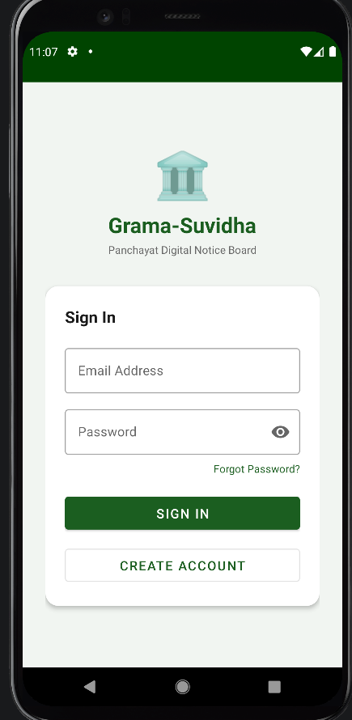
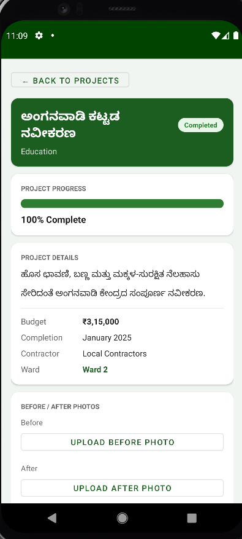
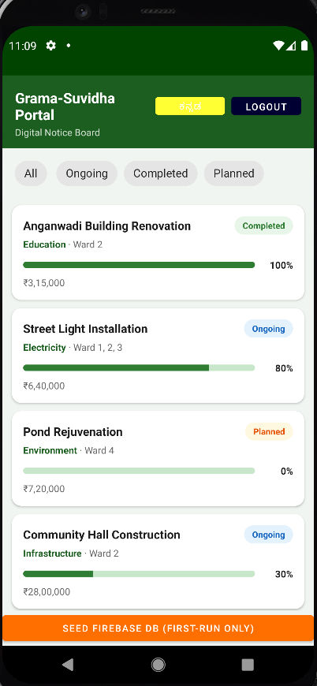

# GramaSuvidha 📱

An Android application built using Kotlin and Firebase to manage and track development projects in rural areas.

---

## 🚀 Features

- 🔐 User Authentication (Login / Signup)
- 📋 Project Listing
- 📄 Project Details View
- 🔄 Navigation using Jetpack Navigation
- ☁️ Firebase Integration (Auth, Firestore)
- 🎨 Modern UI using Jetpack Compose / Material Design

---

## 🛠️ Tech Stack

- **Language:** Kotlin
- **Framework:** Android SDK, Jetpack Components
- **UI:** Jetpack Compose / XML
- **Backend:** Firebase Authentication, Firestore
- **Build Tool:** Gradle

---

## 📂 Project Structure

gramasuvidha/
│── app/
│ ├── src/main/java/com/gramasuvidha/portal/
│ │ ├── ui/
│ │ ├── viewmodel/
│ │ ├── firebase/
│ │ └── MainActivity.kt
│ ├── res/
│ └── build.gradle.kts
│
├── gradle/
├── build.gradle.kts
└── settings.gradle.kts

---

## ⚙️ Setup & Run

1. Clone the repository:
2. 
2. Open in Android Studio

3. Sync Gradle

4. Run the app on emulator or device

---

## 🔥 Firebase Setup

- Add `google-services.json` inside:
-
- Enable:
    - Firebase Authentication
    - Firestore Database

---

## 📸 Screenshots

---

## 📈 Future Improvements

- Push Notifications (FCM)
- Admin dashboard
- Real-time updates
- UI improvements

---

## 👨‍💻 Author

Sowjanya  
https://github.com/SowjanyaManjunathan

---

## 📌 How It Works

- Users can login/signup using Firebase Authentication
- Projects are fetched from Firebase Firestore
- Users can view project details
- Navigation handled using Jetpack Navigation

## 📁 Folder Explanation

- ui/ → UI screens
- viewmodel/ → business logic
- firebase/ → Firebase integration
## 📌 Note

This project is developed as part of an academic submission and demonstrates Android development using Kotlin and Firebase.

## 📌 Project Status

✅ Completed core features  
✅ Firebase integrated  
✅ UI implemented  
🚀 Ready for future enhancements